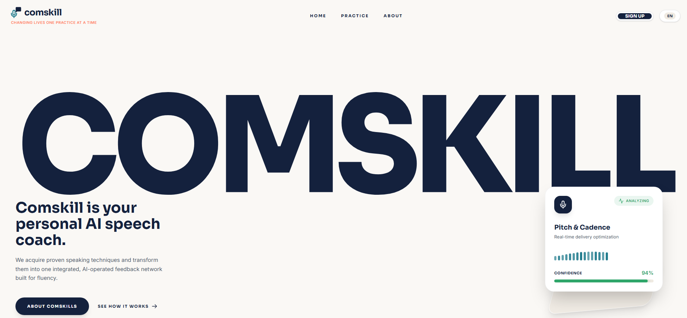

# Comskill

**Your personal AI communication coach.**

Comskill turns proven speaking techniques into one AI-operated feedback network built for fluency. I built this project because of the passion I have for developing communication skills, since at one point in my life I struggled with communication skills. At the moment I'm not where I want to be but I'm also not where I started.

 

---

## Overview

Comskill helps people practise speaking and get feedback on how they deliver, not just what they say. The interface centres on a live analysis view showing pitch, cadence, pacing and a confidence score.

The landing page currently includes:

- A responsive navigation bar with sign-up and language controls
- A full-width COMSKILL wordmark hero
- A live "Pitch & Cadence" analysis card with an animated waveform
- A "Pacing" feedback accent card
- A sign-up route at `/auth`

## Tech stack

| Area | Choice |
| --- | --- |
| Framework | [Next.js](https://nextjs.org/) (App Router) |
| Language | TypeScript / React |
| Styling | [Tailwind CSS](https://tailwindcss.com/) |
| Icons | [lucide-react](https://lucide.dev/) |
| Fonts | Sora (headings) and Inter (body) via Google Fonts |

## Getting started

### Prerequisites

- Node.js 18.18 or newer
- npm, pnpm or yarn

### Installation

```bash
git clone <your-repo-url>
cd comskill
npm install
```

### Run the development server

```bash
npm run dev
```

Open [http://localhost:3000](http://localhost:3000) in your browser.

### Build for production

```bash
npm run build
npm run start
```

## Project structure

```
.
├── app/
│   ├── page.tsx          # Landing page (ComskillLandingPage)
│   └── auth/             # Sign-up / sign-in route
├── public/               # Static assets
├── tailwind.config.ts
└── package.json
```

Adjust this to match your actual folder layout as the project grows.

## Design system

**Colours**

| Name | Hex | Use |
| --- | --- | --- |
| Navy | `#14213D` | Text, primary buttons, wordmark |
| Teal | `#1F7A8C` | Logo mic, waveform, link hover |
| Green | `#2FA66A` | Positive status, confidence score |
| Coral | `#FF7A59` | Accent, tagline, secondary hover |
| Cream | `#FAF8F5` | Page background |
| Sand | `#EFEAE2` | Tracks, plates, subtle fills |
| Slate | `#4A5568` | Body copy |

**Typography**

- **Sora** (600 to 800) for headings, navigation and buttons
- **Inter** (400 to 600) for body copy and small labels

## Notes for contributors

- Keep generated values out of render. Using `Math.random()` inside a component causes hydration mismatches in Next.js, so use fixed data instead.
- Sora's heaviest weight is 800. `font-black` (900) falls back to 800.
- Respect `prefers-reduced-motion` for any new animation.
- Keep interactive elements keyboard-focusable with a visible focus style.

## Roadmap

- [ ] Mobile navigation menu
- [ ] Practice flow (record, analyse, review)
- [ ] Authentication
- [ ] Feedback history and progress tracking
- [ ] Multi-language support (EN selector is in place)

## Author

Built by **Kelvin Kipchumba**.

## License

Add a license before publishing, for example MIT. See [choosealicense.com](https://choosealicense.com/).
